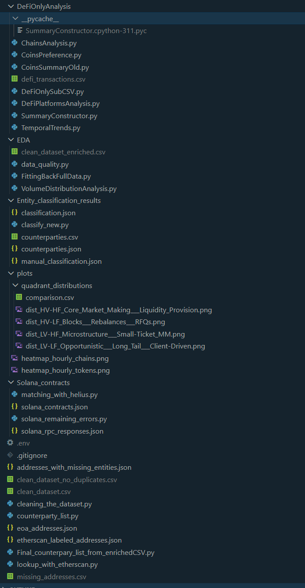
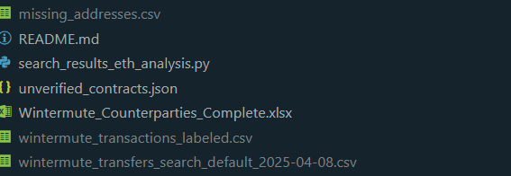
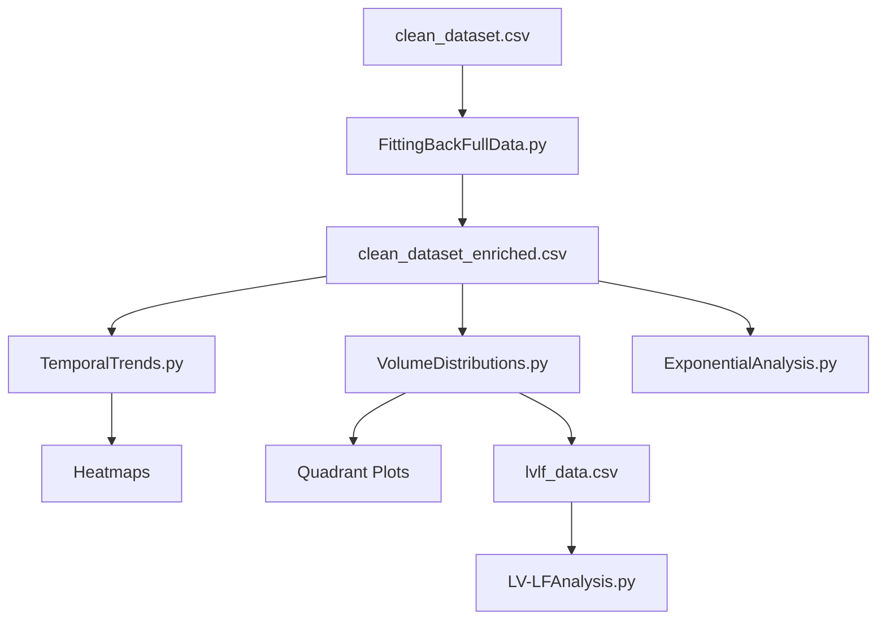

# Syntagma-Labs-Test-Assignment-


(Correct placement of large files)
# DeFi Market Maker Trading Pattern Analysis

Comprehensive exploratory data analysis (EDA) of market-making trading patterns across multiple blockchain networks, focusing on volume distributions, temporal dynamics, and strategic segmentation.

---

## 📋 Table of Contents

- [Overview](#overview)
- [Repository Structure](#repository-structure)
- [Prerequisites](#prerequisites)
- [Installation](#installation)
- [Data Pipeline](#data-pipeline)
- [Analysis Modules](#analysis-modules)
- [Output Files](#output-files)
- [Key Findings](#key-findings)
- [Reproducibility](#reproducibility)
- [Contact](#contact)

---

## 🎯 Overview

This repository contains a complete pipeline for analyzing on-chain trading data from market-making operations. The analysis covers:

- **323,034 transactions** across 11.3 hours (2025-04-08)
- **125 unique tokens** on 6 blockchain networks (Solana, Arbitrum, Base, Ethereum, BSC, Optimism)
- **$844M total volume** with comprehensive entity labeling
- **4 trading quadrants**: Core Market Making, Block Trades, Microstructure, and Opportunistic

**Key Methodologies:**
- Statistical distribution analysis (Log-Normal, Gamma, Weibull, Exponential)
- Temporal pattern recognition (15-minute burst detection, hourly heatmaps)
- Token segmentation by volume × frequency
- Entity enrichment from multiple data sources

---

## 📁 Repository Structure
```
├── clean_dataset.csv                    # Base cleaned dataset (all transactions)
├── wallet_addresses.csv                 # Original raw data (optional)
├── eoa_addresses.json                   # EOA entity mappings
├── etherscan_labeled_addresses.json     # Etherscan labels
├── unverified_contracts.json            # Unverified contract entities
│
├── DeFiOnlyAnalysis/
│   └── defi_transactions.csv            # DeFi-specific subset with entity labels
│
├── EDA/
│   ├── clean_dataset_enriched.csv       # ⭐ FINAL enriched dataset
│   ├── FittingBackFullData.py           # Data enrichment pipeline
│   ├── TemporalTrends.py                # Temporal analysis + heatmaps
│   ├── VolumeDistributions.py           # Quadrant segmentation + distributions
│   ├── LV-LFAnalysis.py                 # Alternative distribution testing (LV-LF)
│   └── ExponentialAnalysis.py           # Exponential distribution testing
│
└── plots/
    ├── quadrant_distributions/          # Distribution plots by quadrant
    │   ├── dist_HV-HF_*.png
    │   ├── dist_HV-LF_*.png
    │   ├── dist_LV-HF_*.png
    │   ├── dist_LV-LF_*.png
    │   ├── comparison.csv
    │   └── lvlf_data.csv
    │
    ├── heatmap_hourly_tokens.png        # Token × Hour heatmap
    ├── heatmap_hourly_chains.png        # Chain × Hour heatmap
    │
    ├── lvlf_alternative_distributions/  # LV-LF alternative fits
    └── exponential_full_dataset/        # Exponential analysis
```

---

## 🔧 Prerequisites

**Python Version:** 3.8+

**Required Libraries:**
```bash
pandas>=1.5.0
numpy>=1.23.0
matplotlib>=3.6.0
seaborn>=0.12.0
scipy>=1.9.0
```

**Optional (for extended analysis):**
```bash
openpyxl>=3.0.0        # Excel file support
python-pptx>=0.6.0     # PowerPoint generation
```

---

## 📦 Installation

### 1. Clone Repository
```bash
git clone https://github.com/yourusername/defi-market-maker-analysis.git
cd defi-market-maker-analysis
```

### 2. Install Dependencies
```bash
pip install pandas numpy matplotlib seaborn scipy --break-system-packages
```

Or using requirements.txt:
```bash
pip install -r requirements.txt --break-system-packages
```

### 3. Verify Data Files
Ensure these files exist in the root directory:
- `clean_dataset.csv`
- `eoa_addresses.json`
- `etherscan_labeled_addresses.json`
- `unverified_contracts.json`
- `DeFiOnlyAnalysis/defi_transactions.csv`

---

## 🔄 Data Pipeline

### Step 1: Data Enrichment
**Script:** `EDA/FittingBackFullData.py`

Enriches the base dataset with entity information from multiple sources.
```bash
cd EDA
python FittingBackFullData.py
```

**What it does:**
1. Loads `clean_dataset.csv` (323,034 transactions)
2. Merges entity labels from:
   - DeFi transactions (highest priority)
   - Etherscan labels
   - EOA addresses
   - Unverified contracts
3. Uses chain-specific + global lookups
4. Outputs: `EDA/clean_dataset_enriched.csv` ⭐

**Output:**
- **File:** `EDA/clean_dataset_enriched.csv`
- **Entity Coverage:** ~95%+ of transactions with at least one entity

---

### Step 2: Temporal Analysis
**Script:** `EDA/TemporalTrends.py`

Analyzes trading patterns over time.
```bash
python TemporalTrends.py
```

**What it does:**
1. **15-Minute Burst Detection** (90th percentile intensity)
   - Identifies high-activity periods
   - Analyzes burst composition (tokens, chains)
   - Detects clustering patterns
2. **Hourly Activity Analysis**
   - Volume and transaction count by hour
   - Peak hours identification
   - Trade size patterns
3. **Token Preferences by Hour**
   - Top 3 tokens per hour
   - Volume distribution
4. **Chain Usage Patterns**
   - Chain distribution by hour
   - Peak hours per chain
5. **Heatmap Generation**
   - Token × Hour heatmap (top 10 tokens)
   - Chain × Hour heatmap

**Outputs:**
- Console: Comprehensive temporal statistics
- `plots/heatmap_hourly_tokens.png`
- `plots/heatmap_hourly_chains.png`

**Key Findings Printed:**
- Burst periods (timing, intensity, composition)
- Peak trading hours
- Token-specific temporal patterns
- Chain usage distribution

---

### Step 3: Volume Distribution & Quadrant Segmentation
**Script:** `EDA/VolumeDistributions.py`

Segments tokens into 4 quadrants and analyzes distributions.
```bash
python VolumeDistributions.py
```

**What it does:**
1. **Tests 5 Segmentation Strategies:**
   - High Percentile (95/90)
   - Trade Size Focus (75/75)
   - Balanced Absolute ($2M / 1k txs)
   - Asymmetric (92/70)
   - **Median Trade Size ($500 / 75th freq)** ← Auto-selected (best balance)

2. **Creates 4 Trading Quadrants:**
   - **HV-HF:** Core Market Making / Liquidity Provision
   - **HV-LF:** Blocks / Rebalances / RFQs
   - **LV-HF:** Microstructure / Small-Ticket MM
   - **LV-LF:** Opportunistic / Long Tail / Client-Driven

3. **Distribution Analysis per Quadrant:**
   - Histogram + KDE
   - Log-scale histogram
   - Normal Q-Q plot
   - Log-Normal Q-Q plot
   - Statistical tests (Shapiro-Wilk)

4. **Exports LV-LF Data** for detailed analysis

**Outputs:**
- `plots/quadrant_distributions/dist_HV-HF_*.png`
- `plots/quadrant_distributions/dist_HV-LF_*.png`
- `plots/quadrant_distributions/dist_LV-HF_*.png`
- `plots/quadrant_distributions/dist_LV-LF_*.png`
- `plots/quadrant_distributions/comparison.csv`
- `plots/quadrant_distributions/lvlf_data.csv` (for deep-dive)

**Key Statistics:**
| Quadrant | Median Trade | Mean Trade | Transactions | % of Total |
|----------|--------------|------------|--------------|------------|
| HV-HF    | $1,093       | $5,552     | 68,990       | 21.4%      |
| HV-LF    | $1,329       | $3,472     | 3,811        | 1.2%       |
| LV-HF    | $194         | $1,796     | 247,941      | 76.8%      |
| LV-LF    | $229         | $1,080     | 2,291        | 0.7%       |

---

### Step 4: Alternative Distribution Testing (Optional)
**Script:** `EDA/LV-LFAnalysis.py`

Tests Gamma, Weibull, and other distributions on LV-LF quadrant.
```bash
python LV-LFAnalysis.py
```

**What it does:**
1. Loads `plots/quadrant_distributions/lvlf_data.csv`
2. Fits 4 distributions: Log-Normal, Gamma, Weibull, Exponential
3. Performs KS tests and calculates AIC
4. Generates comparative plots

**Outputs:**
- `plots/lvlf_alternative_distributions/lvlf_distribution_comparison.png`
- `plots/lvlf_alternative_distributions/lvlf_qq_plots.png`
- `plots/lvlf_alternative_distributions/distribution_comparison.csv`

---

### Step 5: Exponential Distribution Analysis (Optional)
**Script:** `EDA/ExponentialAnalysis.py`

Tests exponential distribution on full dataset.
```bash
python ExponentialAnalysis.py
```

**What it does:**
1. Loads `clean_dataset_enriched.csv`
2. Fits exponential distribution
3. Performs KS, Anderson-Darling tests
4. Compares AIC with Normal and Log-Normal
5. Analyzes tail behavior

**Outputs:**
- `plots/exponential_full_dataset/exponential_analysis_full.png`
- `plots/exponential_full_dataset/exponential_tail_analysis.png`
- `plots/exponential_full_dataset/exponential_summary.csv`

---

## 📊 Output Files

### Final Dataset
**Location:** `EDA/clean_dataset_enriched.csv`

**Columns:**
```
timestamp, from_address, to_address, from_entity, to_entity, 
token, usd, chain, tx_hash
```

**Size:** ~323,034 rows × 9 columns

---

### Distribution Plots
**Location:** `plots/quadrant_distributions/`

Each quadrant has a 4-panel plot:
1. Histogram + KDE
2. Log-scale histogram
3. Normal Q-Q plot
4. Log-Normal Q-Q plot

**Files:**
- `dist_HV-HF_Core_Market_Making___Liquidity_Provision.png`
- `dist_HV-LF_Blocks___Rebalances___RFQs.png`
- `dist_LV-HF_Microstructure___Small-Ticket_MM.png`
- `dist_LV-LF_Opportunistic___Long_Tail___Client-Driven.png`

---

### Heatmaps
**Location:** `plots/`

1. **Token × Hour Heatmap** (`heatmap_hourly_tokens.png`)
   - Top 10 tokens by volume
   - Shows % of each token's daily volume per hour
   - Identifies temporal trading preferences

2. **Chain × Hour Heatmap** (`heatmap_hourly_chains.png`)
   - All chains (Solana, Arbitrum, Base, Ethereum, BSC, Optimism)
   - Shows % of each hour's transactions per chain
   - Reveals chain usage patterns

---

### Summary Statistics
**Location:** `plots/quadrant_distributions/comparison.csv`

Comparative statistics across all quadrants:
- Sample size (n)
- Median, Mean, IQR
- Skewness, Coefficient of Variation
- Normality test p-values
- Log-normal test p-values

---

## 🔍 Key Findings

### 1. Distribution Characteristics
- **All quadrants exhibit log-normal distributions** (confirmed via Q-Q plots)
- **Heavy right tails** consistent with professional market-making
- **LV-HF contains largest outlier** ($12.1M trade) despite $194 median

### 2. Temporal Patterns
- **Peak activity:** 09:00 UTC (21.5% of WETH volume)
- **AAVE spike:** 72% of daily volume at 08:00 UTC (scheduled rebalancing)
- **Solana dominance:** 60-69% across all hours (stable infrastructure)
- **15-minute bursts:** Identified 5 high-intensity periods

### 3. Trading Quadrants
- **LV-HF dominates:** 76.8% of transactions (microstructure market-making)
- **HV-HF:** 21.4% of transactions, 45.4% of volume (core liquidity)
- **Clear median separation:** $194 (LV-HF) vs $1,093 (HV-HF) = 5.6×

### 4. Statistical Validation
- **Log-normal best fit** across all categories (lowest AIC)
- **Exponential rejected** (p < 0.01 on full dataset)
- **All normality tests rejected** (expected for financial data)

---

## 🔄 Reproducibility

### Full Pipeline Execution

**Run all scripts in sequence:**
```bash
# 1. Data Enrichment
cd EDA
python FittingBackFullData.py

# 2. Temporal Analysis
python TemporalTrends.py

# 3. Distribution Analysis
python VolumeDistributions.py

# 4. Optional: Alternative Distributions
python LV-LFAnalysis.py

# 5. Optional: Exponential Analysis
python ExponentialAnalysis.py
```

**Expected Runtime:**
- Data Enrichment: ~5-10 minutes
- Temporal Analysis: ~2-3 minutes
- Distribution Analysis: ~3-5 minutes
- Alternative Distributions: ~2 minutes
- Exponential Analysis: ~2 minutes
- **Total: ~15-25 minutes**

---

### Troubleshooting

**Issue:** `FileNotFoundError: clean_dataset.csv`
**Solution:** Ensure you're in the project root directory. Run:
```bash
ls -la clean_dataset.csv
```

**Issue:** `ModuleNotFoundError: No module named 'scipy'`
**Solution:** Install dependencies:
```bash
pip install scipy --break-system-packages
```

**Issue:** `AttributeError: 'NoneType' object has no attribute 'strip'`
**Solution:** This occurs if JSON files have null values. The enrichment script handles this automatically.

**Issue:** Plots not generating
**Solution:** Create output directories:
```bash
mkdir -p plots/quadrant_distributions
mkdir -p plots/lvlf_alternative_distributions
mkdir -p plots/exponential_full_dataset
```

---

## 📈 Analysis Workflow Summary


---

## 📝 Citation

If you use this analysis framework, please cite:
```bibtex
@misc{defi_market_maker_analysis_2025,
  title={DeFi Market Maker Trading Pattern Analysis},
  author={Your Name},
  year={2025},
  publisher={GitHub},
  url={https://github.com/yourusername/defi-market-maker-analysis}
}
```

---

## 📧 Contact

**Author:** [Your Name]  
**Email:** your.email@example.com  
**LinkedIn:** [Your LinkedIn]  
**GitHub:** [@yourusername](https://github.com/yourusername)

---

## 📄 License

This project is licensed under the MIT License - see the LICENSE file for details.

---

## 🙏 Acknowledgments

- **Data Sources:** Etherscan, on-chain transaction logs
- **Entity Labeling:** Multiple sources including EOA registries and contract verification services
- **Statistical Methods:** Scipy, NumPy, Pandas
- **Visualization:** Matplotlib, Seaborn

**Last Updated:** November 26, 2025  
**Version:** 1.0.0
